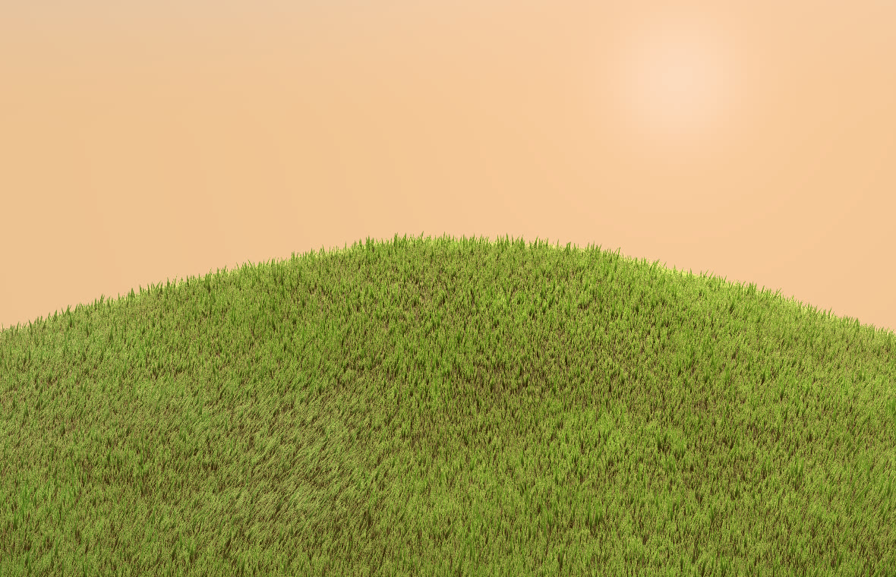
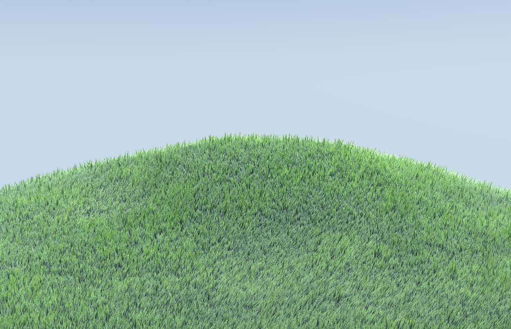
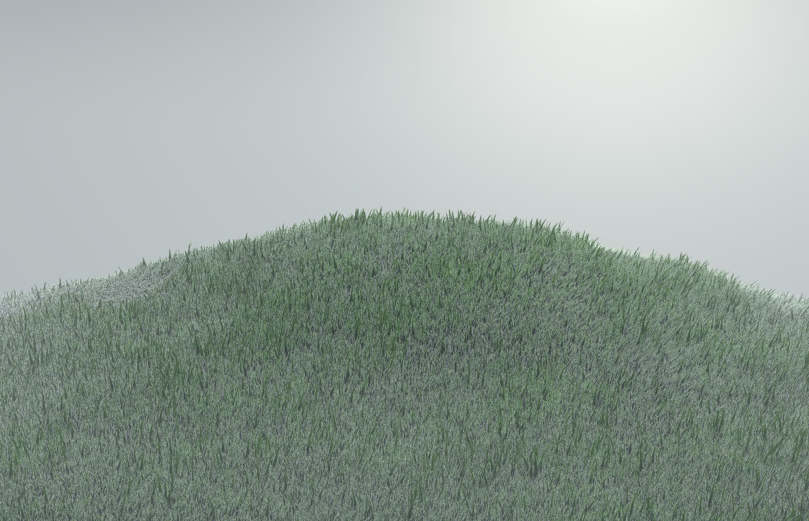
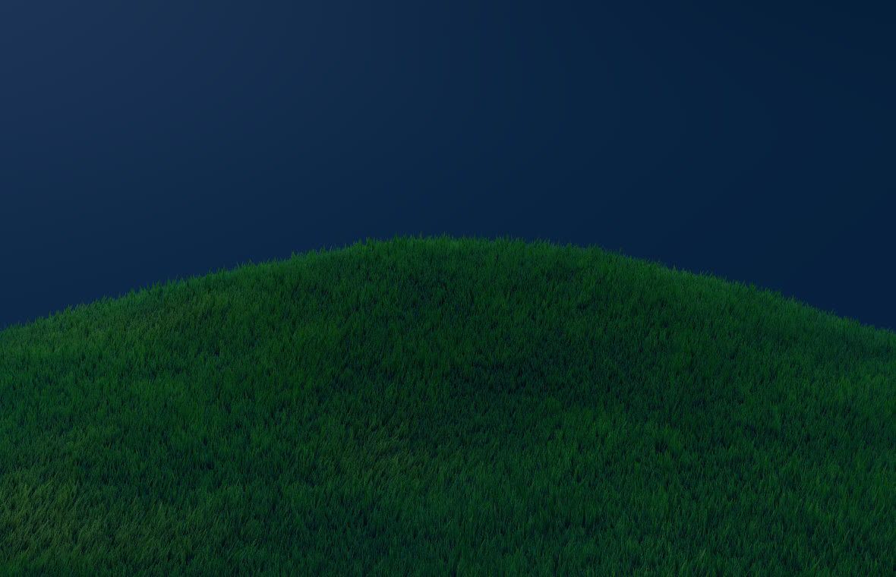

# Windcrest

A hill where every blade of grass is real geometry. A few hundred thousand blades, one instanced draw
call, and nothing animated on the CPU. Everything you can see is on a slider: how much grass there is
and how it grows, what the wind does to it, how it is lit, and the two tricks that keep it from
shimmering.

**Live demo:** https://kloserock97-tech.github.io/windcrest/



This is the grass from the first screen of [my portfolio](https://kloserock97-tech.github.io/gorbachev-nikita-product-designer/),
taken out of the scene and put on a panel.

## The idea

A blade is not a texture on a card. It is seven vertices with a little data attached: where it stands,
which way it faces, how long it is, and which tuft it belongs to. That data is written once, when the
meadow is planted, and never touched again.

Every frame the vertex shader answers one question for each blade: where is the tip right now? The
answer depends on the wind at that spot, on the cursor, and on the camera. There is no simulation and
no state carried from frame to frame, which pays for most of the good behaviour:

- **The blade count is a slider.** 20 thousand or 600 thousand, the meadow looks the same, only denser.
- **Time is a number.** Freeze it and the hill stops mid-gust, exactly as it was.
- **The CPU does nothing per blade.** It uploads a clock and a wind direction. The draw call is one.

## How the meadow grows

Blades are planted by rejection sampling. A random spot on the disc survives with the density the
meadow should have there: slow noise thins some patches, and near the rim the grass fades out instead
of stopping on a line.

Then each blade finds its cell in a jittered Voronoi grid, steps a little towards the cell centre and
remembers how far to lean. Blades of one cell share a height and a tone. That is what turns a carpet
into tufts with gaps between them, and **tuft size** and **lean into tufts** change it live.

Length is 9 to 18 centimetres on purpose. Shorter grass is detail smaller than a pixel: the screen
cannot show it, it can only shimmer.

## Wind

The wind is not a sine wave rolling over the field. It is patches: two layers of value noise scroll
downwind at different speeds and are thresholded, so there are calm areas between the gusts. A weak
travelling wave stays underneath so the slope still reads as one surface.

A blade keeps its length. The further the tip is pushed sideways, the lower it sits, so a gust flattens
the grass instead of stretching it. Flattened blades also turn their pale underside up, and that is the
silver patch you see running across the hill.

The noise uses an integer hash. A sine-based hash loses precision at the coordinates blades live at,
and the wind starts to band.

## Two tricks against shimmer

Thin geometry is the hardest thing to draw calmly. A blade that is half a pixel wide hits a pixel
centre on one frame and misses it on the next, and no amount of antialiasing fixes that.

1. **Minimum width in pixels.** The shader knows the size of a pixel at the blade's distance and never
   lets a blade get thinner than that. Set **min width** to zero to see what it prevents.
2. **Widening with distance.** Fewer blades land on a pixel as distance grows, so the ones that remain
   get wider and the turf does not thin out into speckle. Blades seen edge-on get wider too.

On top of that the blade edge is drawn with **alpha to coverage**: the distance to the edge, measured
in pixels through `fwidth`, becomes a share of MSAA samples. A slanted blade stops being a staircase.

## Light

Lighting is computed per vertex. Blades overlap several layers deep, so anything done per fragment is
paid many times over. Three things make a flat ribbon read as grass:

- a **rounded normal**: the edges of the ribbon look sideways and the middle looks forward, so the strip
  shades like a round stem without extra geometry;
- **light through the tips** when you look towards the sun, kept off the very tip, where it would
  collect into a line of bright dots;
- **self-shadowing**: almost no sky reaches the roots, so the turf has depth.

Far away the blade normal settles onto the slope normal, and light stops jumping from pixel to pixel.

## Controls

| Group | What it does |
| --- | --- |
| **blades / radius** | how many blades and how wide the meadow is |
| **tuft size / lean into tufts** | the Voronoi cell and how strongly blades gather into it |
| **blade length / width / shape** | size of a blade, and 7 vertices or a 3-vertex far LOD |
| **strength / direction / gust size / flutter** | the wind: how hard, where from, how big the patches are, how much a blade shivers |
| **cursor radius** | how wide the trail you leave in the grass is |
| **sun height / direction / power, light through tips** | the sun |
| **sky light, from above, from below, haze, horizon, zenith** | the sky and the air |
| **root / middle / tip / dry tips** | grass colour along the blade, and the share of sun-bleached blades |
| **min width / widen with distance / alpha to coverage** | the anti-shimmer tricks, each can be switched off |

`H` hides the panel, `Space` freezes time, drag to orbit, scroll to zoom, move the pointer over the grass.

Five presets are included (sunset, midday, gale, august, moonlit). **Copy link to this look** puts the
whole setup in the address bar, so a version you liked can be sent to someone as a plain URL.

| midday | gale | moonlit |
| --- | --- | --- |
|  |  |  |

## Performance

Three draw calls: the sky, the ground and the grass. The cost is almost entirely the grass vertex
shader, so the useful dials are **blades** and **blade shape**: a 3-vertex blade costs less than half
of a 7-vertex one, and at a distance you cannot tell them apart. The portfolio scene uses both at once,
7 vertices near the camera and 3 further away.

On an Intel Arc integrated GPU the defaults (380k blades, 7 vertices, MSAA) hold the 165 Hz refresh
rate of the display at 1368×775; 600k blades run at about 130 fps.

## Running it

Node 22 or newer.

```bash
npm install
npm run dev       # http://localhost:5173
npm run build     # static site into dist/
npm run preview
```

`.github/workflows/deploy.yml` publishes `dist/` to GitHub Pages on every push to `main`.

Four files matter: `src/grass.glsl.js` is the grass, the ground and the sky as shader source,
`src/terrain.js` is the hill and the Voronoi tufts, `src/main.js` plants the meadow and wires the panel,
`src/settings.js` holds defaults, presets and the URL encoding. No models, no textures, no data files.
The whole thing is code.

## Prior art

Instanced grass bent in the vertex shader is a common technique in real-time graphics. The talk
"Procedural Grass in Ghost of Tsushima" (GDC 2021) is where the ideas of tufts, rounded normals and
visible wind come from; it was used as a reference only. The construction here and all of the code are
my own. Built with [three.js](https://threejs.org) and [lil-gui](https://lil-gui.georgealways.com).

## Licence

Source-available under the [PolyForm Noncommercial License 1.0.0](LICENSE): free for personal,
study, research and other noncommercial use. **Commercial use needs a paid license**, see
[COMMERCIAL.md](COMMERCIAL.md) or write to kloserock97@gmail.com. Third-party parts keep their own
licenses, listed in [THIRD_PARTY_NOTICES.md](THIRD_PARTY_NOTICES.md).

Nikita Gorbachev · kloserock97@gmail.com ·
[LinkedIn](https://www.linkedin.com/in/nikita-gorbachev-productdesigner)
